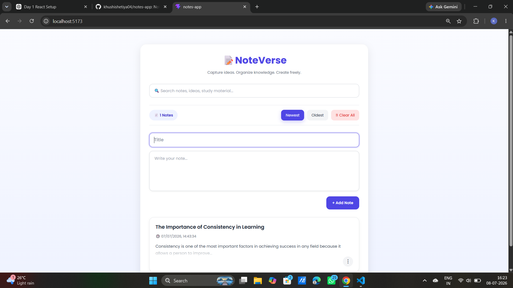
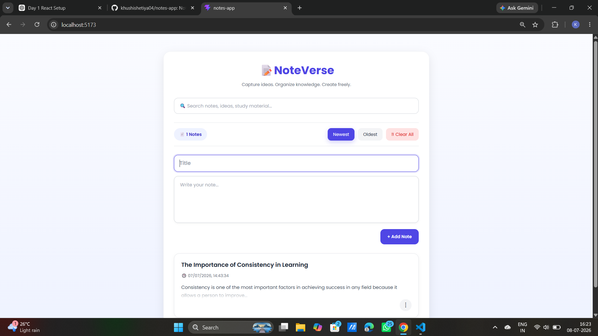

# 📝 NoteVerse

A modern Notes Application built with **React** that helps users create, organize, and manage notes efficiently.

## ✨ Features

- Create notes with title and content
- Edit existing notes
- Delete notes
- Pin and unpin important notes
- Search notes by title or content
- Sort notes by newest or oldest
- View complete note on a separate page
- Automatically saves notes using Local Storage
- Responsive and clean UI

## 🛠 Tech Stack

- React
- React Router DOM
- JavaScript (ES6+)
- CSS3
- Local Storage

## 📂 Project Structure

```
src/
│
├── components/
│   ├── Navbar.jsx
│   ├── NoteCard.jsx
│   ├── NoteInput.jsx
│   ├── NoteList.jsx
│   └── SearchBar.jsx
│
├── pages/
│   ├── Home.jsx
│   └── ViewNote.jsx
│
├── App.jsx
└── main.jsx
```

## 🚀 Installation

Clone the repository

```bash
git clone https://github.com/khushishetiya04/notes-app.git
```

Go to the project folder

```bash
cd Notes-App
```

Install dependencies

```bash
npm install
```

Start the development server

```bash
npm run dev
```

## 📸 Screenshots

### Home Page


### View Note


## 📌 Future Improvements

- Dark Mode
- Categories
- Favorites
- Export Notes
- Import Notes
- Toast Notifications
- Responsive Mobile Design

## 👩‍💻 Author

**Khushi Shetiya**
GitHub: https://github.com/khushishetiya04